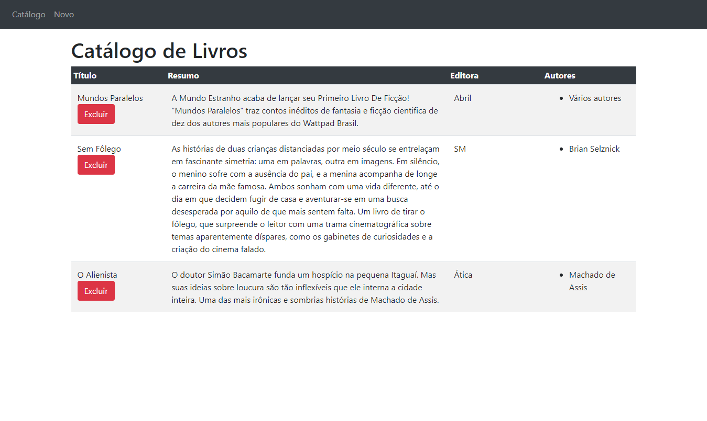
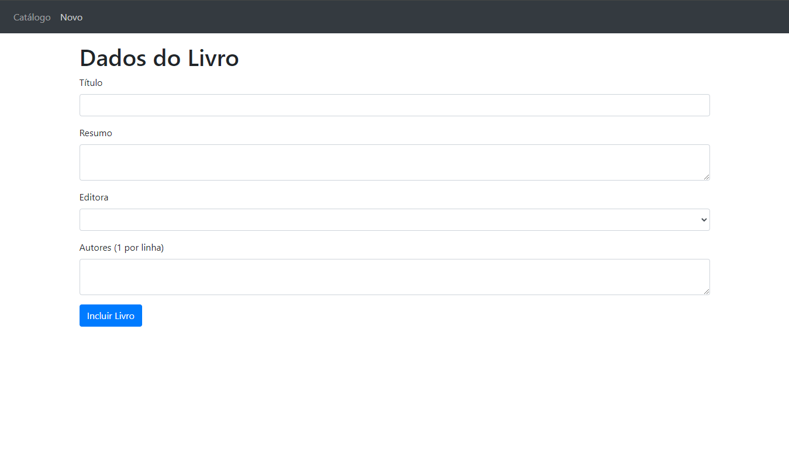
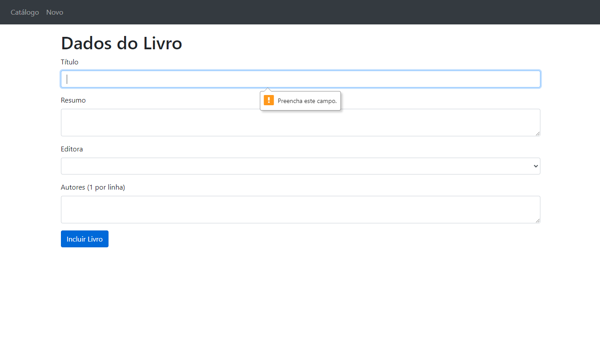

# 

# RPG0011 - Conhecendo outro framework

---

Missão prática | Nível 4 | Mundo 2 do Curso Desenvolvimento Full-Stack da Universidade Estácio.

🔗 [Projeto](#-Projeto) - [Descrição](#-Descrição) - [Objetivo](#-Objetivo) - [Materiais_necessários](#-Materiais_necessários) - [Imagens](#-Imagens) - [Autor](#-Autor).

---

## 📋 Projeto

Exemplos de diferentes formas de utilização do `Javascript` no lado cliente, uso de `JSON` na transmissão de dados e framework `VueJS`, uma `Missão Prática` do curso de `Desenvolvimento Full-Stack` da `Universidade Estacio de Sá` do `2º Mundo` do semestre de `2024.1`.

---

## 📝 Descrição

Para facilitar a implementação deste projeto precisamos:

- Criar um objetivo especifico.
- Materiais necessários para a prática.
- Metodologia de Desenvolvimento da Prática.

---

## 💼 Objetivo

A partir dos objetivos listados abaixo, no final do projeto, você terá criado todos os
elementos necessários para exibição e entrada de dados no ambiente do Angular,
tornando-se capacitado para lidar com contextos reais de aplicação do framework:

1. Implementar serviços injetáveis para o Angular, na sintaxe `Type Script`.
2. Implementar componentes, utilizando `Type Script` e modelos `HTML`.
3. Utilizar a biblioteca para `gerenciamento de formulários` no `Angular`.
4. Implementar a `navegação interna` do front-end com `base em Angular`.

---

## 🛠 Materiais_necessários

Materiais necessários para a prática

1. Computador com acesso à internet;
2. Editor de código Visual Studio Code;
3. Ambiente de desenvolvimento NodeJS.
4. Navegador de internet instalado no computador.

---

## 🔎 Imagens

Página Inicial | Catálogo

Pagina Cadastro

Verficação de Formulários

---

## 👩‍💻 Autor

Este repositório foi desenvolvido por
|Autor|
|----------------|
| Antonio Vitor

Para mais informação fique livre para entrar em contato `comigo`.
